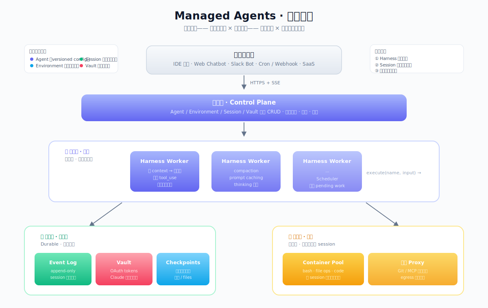
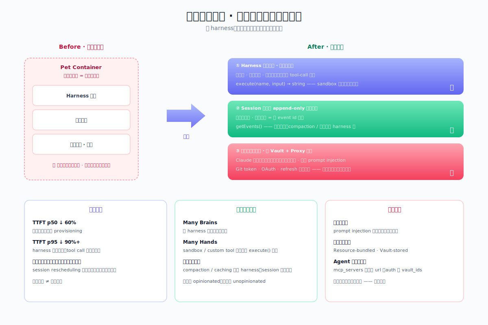
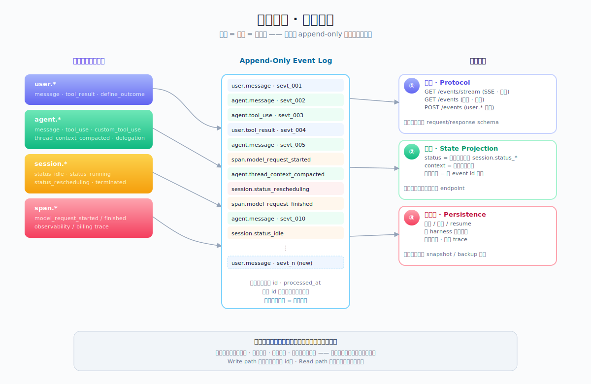
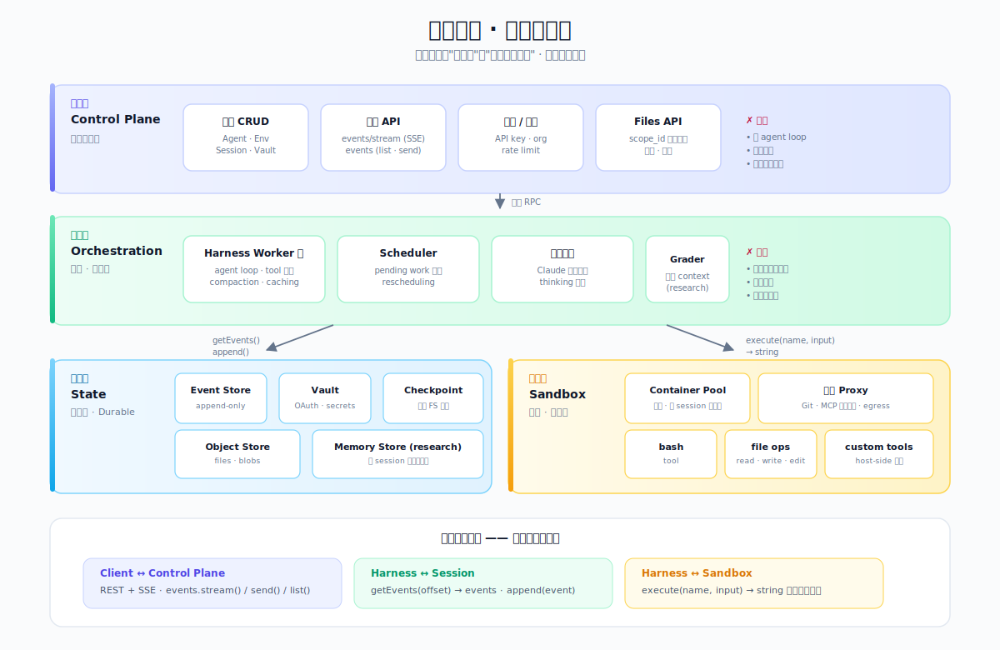
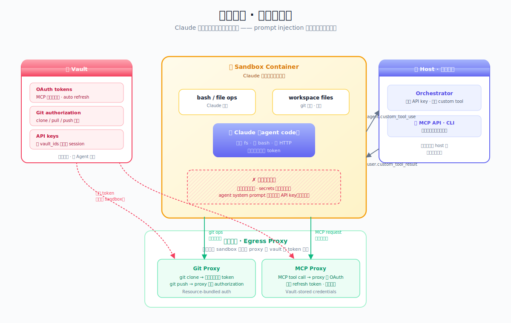
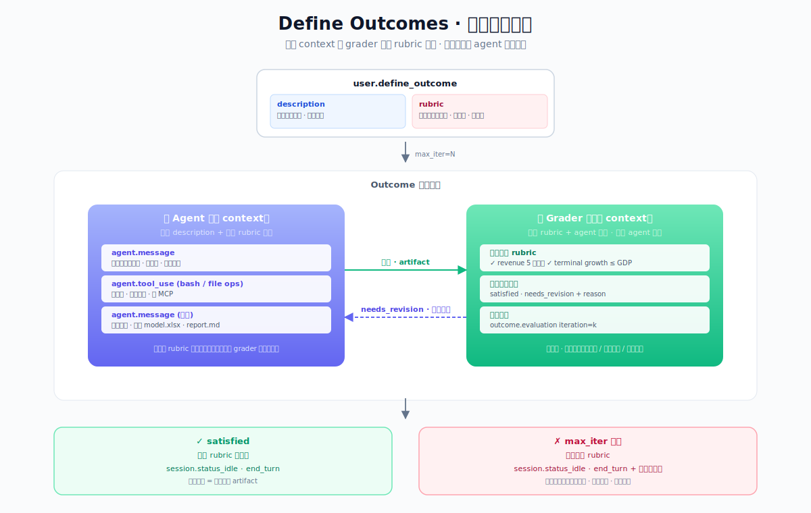
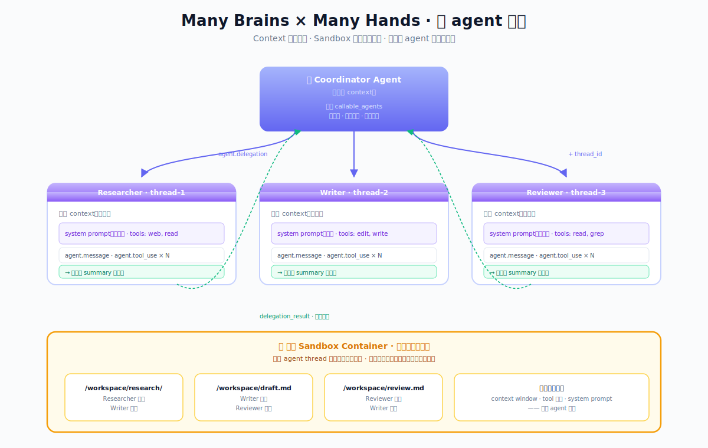
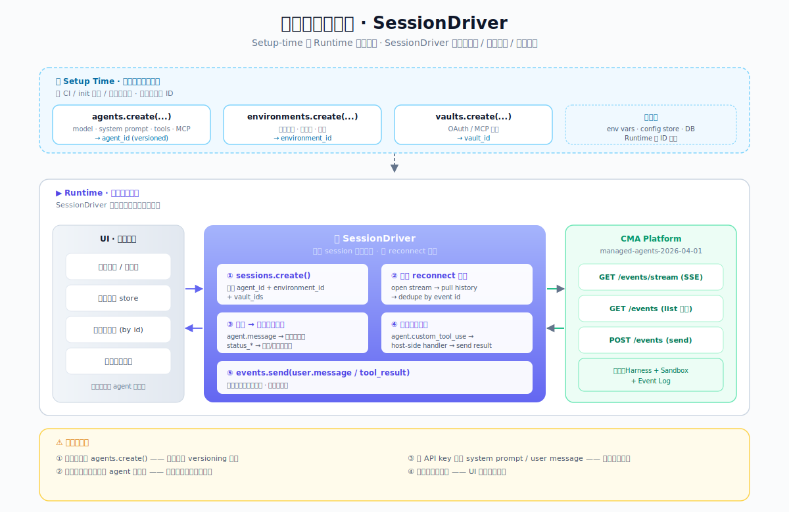

# 深入理解 Managed Agents

<p align="center">
  
</p>

<p align="center">
  
  
  
  
</p>

<p align="center">
  <i>English version — coming soon</i>  |  <b>中文</b>
</p>

> **一份面向 Anthropic Managed Agents Beta API 的系统性设计分析 —— 从「把大脑和双手解耦」的设计哲学出发，一路走到事件协议、安全边界、客户端最佳实践，以及 Outcomes / Multi-agent / Memory 三个高阶 harness 模式。**

> [!TIP]
> **TL;DR** —— Managed Agents 不是「又一个 agent 框架」，而是**一组让各种 harness 都能跑的基础设施接口**。它对「agent 需要什么」强 opinionated（durable 日志、沙箱、凭证隔离、无状态编排），对「怎么实现」保持开放。三条架构决策——把 harness 搬出容器、把 session 做成 append-only 事件日志、把凭证钉在 vault 里——决定了这套平台能活得比任何单个 Claude 版本都长。

---

## 目录

**设计视角**

- [🌟 关键亮点](#-关键亮点)
- [📖 阅读指南](#-阅读指南)
- [🏗️ 架构总览](#️-架构总览)
- [🧭 三条解耦决策](#-三条解耦决策)
- [📡 事件模型 · 三件合一](#-事件模型--三件合一)
- [🧱 四层架构](#-四层架构)
- [🔐 凭证隔离 · 物理级边界](#-凭证隔离--物理级边界)

**高阶模式**

- [🎯 Define Outcomes · 目标驱动执行](#-define-outcomes--目标驱动执行)
- [👥 Many Brains × Many Hands](#-many-brains--many-hands)
- [🚗 客户端架构 · SessionDriver](#-客户端架构--sessiondriver)

**导航与资源**

- [📚 五份文档速览](#-五份文档速览)
- [🧠 八条核心洞察](#-八条核心洞察)
- [🔗 相关资源](#-相关资源)
- [⚖️ 许可证](#️-许可证)

---

## 🌟 关键亮点

- **三条架构决策，一个元原则** —— harness 搬出容器、session 外置为事件日志、凭证永不进沙箱；底下贯穿的是「对接口 opinionated，对实现 unopinionated」。
- **事件即协议、即状态、即持久化** —— 一份 append-only 日志折叠了三个维度，许多「状态不一致」「缓存失效」的经典问题被从源头取消。
- **TTFT p50 ↓ 60% / p95 ↓ 90%+** —— harness 去容器化之后，推理不再等容器 provisioning，tool call 时再按需接沙箱。
- **凭证物理级隔离** —— 不是「信任但验证」，是 Claude 能接触的世界里**根本不存在** token；prompt injection 拿不到不存在的东西。
- **Many Brains × Many Hands** —— 多 agent 协作共享同一份 sandbox 文件系统，但 context 相互隔离，每个子 agent 只回传摘要。
- **三个 research preview 精确打掉标准 loop 的三个隐含假设** —— Outcomes 把成功从「agent 说完了」重定义成「rubric 通过了」；Multi-agent 打掉「一个 context」；Memory 打掉「一次 session」。

---

## 📖 阅读指南

| 如果你是…… | 从这里开始 | 然后读 |
|:---|:---|:---|
| **平台工程师 / 想复现这套平台** | [`managed-agents-implementation-guide.md`](./managed-agents-implementation-guide.md) | [`managed-agents-design-philosophy.md`](./managed-agents-design-philosophy.md) |
| **应用开发者 / 想接入 CMA** | [`managed-agents-client-best-practices.md`](./managed-agents-client-best-practices.md) | [`managed-agents-event-design.md`](./managed-agents-event-design.md) |
| **Agent 研究者 / 想了解高阶能力** | [`managed-agents-advanced-patterns.md`](./managed-agents-advanced-patterns.md) | [`managed-agents-design-philosophy.md`](./managed-agents-design-philosophy.md) |
| **架构评审 / 决策者** | [关键亮点](#-关键亮点) | [三条解耦决策](#-三条解耦决策) → [四层架构](#-四层架构) |
| **安全 / 合规** | [凭证隔离](#-凭证隔离--物理级边界) | [`managed-agents-design-philosophy.md`](./managed-agents-design-philosophy.md) 第三节 |

`5 份文档` · `~7000 行中文分析` · `8 张架构图` · `managed-agents-2026-04-01`

---

## 🏗️ 架构总览

Managed Agents 是一套**让 agent harness 得以扩展**的基础设施。它回答四个问题：

| 问题 | 答案 |
|:---|:---|
| Harness 放在哪？ | 从容器里搬出来，退居编排层。无状态、可水平扩展。 |
| 会话状态存在哪？ | 外部化为 append-only 事件日志。Session 只保证「日志 durable」。 |
| 凭证放在哪？ | 独立 Vault 资源 + 出站 Proxy 注入。容器里**物理上**拿不到。 |
| 接口是什么？ | REST + SSE；`getEvents()`；`execute(name, input) → string`。 |

系统分为四层：**控制面**（CRUD + 事件 API）→ **编排层**（无状态 harness workers）→ **状态层**（event log / vault / checkpoint）+ **沙箱层**（container pool + proxy）。四个核心资源：`Agent`、`Environment`、`Session`、`Vault`。

> 📄 **深入阅读** —— [`managed-agents-design-philosophy.md`](./managed-agents-design-philosophy.md) 第二、四、六节；
> [`managed-agents-implementation-guide.md`](./managed-agents-implementation-guide.md) 第二节「技术架构总览」。

<p align="right"><a href="#深入理解-managed-agents">↑ 返回顶部</a></p>

---

## 🧭 三条解耦决策

<p align="center">
  
</p>

最初的 Managed Agents 把 harness、会话状态、工具执行全塞在同一个容器里——一个容易退化成「宠物」的形态。容器挂掉 = 会话全丢；调试要进用户容器 = 安全边界与运维打架。

三条架构决策把这条路径逐层拆开：

### ① Harness 搬出容器

Harness 不再住在容器里，而是退到 Anthropic 的编排层，通过**通用接口**调容器：

```
execute(name, input) → string
```

从 harness 的角度看，sandbox 跟任何别的工具没区别。容器崩溃不再是「会话崩溃」，而是「一次 tool-call 失败」——Claude 自己决定重试、换方式还是告诉用户出问题了。

**在 Beta API 中的体现**：Agent / Session / Environment 是三个独立资源；Session 的 `rescheduling` 状态是这条解耦的直接语义——可重试错误由编排层处理，会话继续。

### ② Session 外置为事件日志

Harness 无状态之后，上下文存在别处——一份 append-only 事件日志。关键接口是 `getEvents()`：它不是「给我当前状态」，而是**灵活的切片接口**。harness 可以从上次停止处读起、回退到某事件前重拼 context、或重读历史恢复情境。

Session 只保证一件事：**日志 durable**。怎么读、怎么裁剪、怎么压缩——是 harness 的自由，也是未来可演进的空间。

### ③ 凭证永不进沙箱

只要 Claude 生成的代码能接触凭证，prompt injection 就有一个永远存在的攻击面。Managed Agents 的做法是**彻底切断这条路径**：

- **Resource-bundled auth**：Git token 只在 sandbox 初始化时用一次；之后 Claude 完全接触不到。
- **Vault-stored credentials**：MCP 工具的 OAuth token 集中存 Vault；**请求离开 sandbox 后**由 proxy 从 Vault 取 token 注入。

容器里**设不了环境变量**——不是没做，是**故意**不做。一旦允许往容器里塞密钥，整条隔离链就破了。

> 📄 **深入阅读** —— [`managed-agents-design-philosophy.md`](./managed-agents-design-philosophy.md) 第三节「宠物 vs 牛群」。

<p align="right"><a href="#深入理解-managed-agents">↑ 返回顶部</a></p>

---

## 📡 事件模型 · 三件合一

<p align="center">
  
</p>

构建能跑长任务的 agent 平台，client-server 交互有三种典型选择——RPC 撑不住长任务、Long-lived RPC 状态和内容分家、WebSocket 断线即丢。Managed Agents 面对的是**三维都有要求**的场景：长任务 × 实时反馈 × 可恢复。

它的答案是把这三种需求折叠进一个抽象：

> **客户端和服务端只通过「事件」沟通，所有事件构成一份 append-only 日志，日志即 session 状态。**

这个选择带来一个多米诺式的简化：

| 维度 | 传统做法 | CMA 做法 |
|:---|:---|:---|
| 协议 | REST / gRPC schema | 事件序列 |
| 状态 | DB schema + cache | 日志投影 |
| 持久化 | log + snapshot | 日志本身 |
| 恢复 | snapshot / replay | 重放事件 |
| 观测 | 独立 trace 流 | span 事件 |
| 多消费 | fan-out 层 | 多订阅同一流 |

三者不是「协作」，而是**同一个对象的三种用法**。四个事件命名空间（`user.*` / `agent.*` / `session.*` / `span.*`）承载所有交互——工具权限、多 agent、outcome、custom tool，每个「特性」都是**既有事件类型的组合**，不是独立的协议层。

> 📄 **深入阅读** —— [`managed-agents-event-design.md`](./managed-agents-event-design.md) 全文。

<p align="right"><a href="#深入理解-managed-agents">↑ 返回顶部</a></p>

---

## 🧱 四层架构

<p align="center">
  
</p>

**每一层都有「做的事」和「明确不做的事」**——这是保持接口稳定、实现可演进的关键。

| 层 | 核心责任 | 不做的事 |
|:---|:---|:---|
| **控制面** | 资源 CRUD、事件收发、认证授权、配额 | 跑 agent loop、执行工具、存业务数据 |
| **编排层** | 运行 harness loop、调度 session 到 worker、context/compaction | 持久化任何状态、持有凭证 |
| **状态层** | Durable 存储（event log、vault、checkpoint、object、memory） | 做业务逻辑、跑工具 |
| **沙箱层** | 执行 tool call（bash、file ops、MCP）、容器生命周期 | 读 session 日志、持久化 context |

**三个核心接口**——层间解耦的关键：

- `Client ↔ Control Plane` ：REST + SSE · `events.stream() / send() / list()`
- `Harness ↔ Session` ：`getEvents(offset) → events · append(event)`
- `Harness ↔ Sandbox` ：`execute(name, input) → string`（**唯一**）

编排层和沙箱层之间只有这一个接口——这是整个架构的核心解耦点，对应 engineering 博客里的 "Harness Leaves the Container"。

> 📄 **深入阅读** —— [`managed-agents-implementation-guide.md`](./managed-agents-implementation-guide.md) 第四、五、六、七节。

<p align="right"><a href="#深入理解-managed-agents">↑ 返回顶部</a></p>

---

## 🔐 凭证隔离 · 物理级边界

<p align="center">
  
</p>

这个设计把「Claude 会不会被 prompt injection 骗出 token」这个问题，变成了一个**物理上没有答案**的问题——凭证根本不在它能触达的地方。

**在 Beta API 中的体现**：

- Agent 的 `mcp_servers` 数组只声明 `type / name / url`，**不带 auth 字段**。认证信息不污染可复用的 agent 定义。
- Vault 是**独立资源**。`vault_ids` 在 session 创建时传入，与 agent 解耦；Anthropic 自动用 refresh token 续期 OAuth。
- GitHub 仓库的 `authorization_token` **通过 git proxy 注入**。`git pull / push` 都走代理，Claude 写的任何代码都拿不到。
- **容器里没办法设置环境变量**——一旦允许往容器里塞密钥，整条隔离链就破了。
- **非 MCP 的 API 或 CLI 需要密钥时，走 custom tools**：agent 发出 `agent.custom_tool_use`，你的 orchestrator（host 端，持有密钥）执行调用，通过 `user.custom_tool_result` 把结果送回去。
- **把 API key 写进 system prompt 或 user message** 是明确的反模式——会进事件历史，会进 compaction 摘要，整个 session 生命期内可读。

<p align="right"><a href="#深入理解-managed-agents">↑ 返回顶部</a></p>

---

## 🎯 Define Outcomes · 目标驱动执行

<p align="center">
  
</p>

标准 agent loop 成功的标志是「agent 说完了」（`end_turn`）——**而不是「任务达成了」**。Define Outcomes 打掉这个假设：

```
标准:     user.message → agent.message + tools → idle(end_turn)

Outcome:  user.define_outcome(desc, rubric, max_iter=5)
            → agent 工作一轮 → grader 对照 rubric 评估
            → 未满足 → agent 再工作一轮 → 再评估
            → satisfied | needs_revision 耗尽 → idle(end_turn)
```

关键在 **grader** —— 一个**独立 context 窗口里跑的 Claude 实例**，只看 rubric + agent 产出，不看 agent 思考过程。独立 context 避免「agent 一边实现一边自评」的同流合污，也让未来可以把 grader 换成不同模型甚至人工介入。

**好 rubric 的四个特征**：

- **原子化**：每条是一个独立可判断的句子
- **可验证**：grader 能从产出本身判断，不需要重跑 agent 工具
- **分层**：按 section 分类，不堆一起
- **显式边界**：关键常数和公式直接写清楚

> 📄 **深入阅读** —— [`managed-agents-advanced-patterns.md`](./managed-agents-advanced-patterns.md) 第二节 + 附录 A（DCF 分析 agent 完整示例）。

<p align="right"><a href="#深入理解-managed-agents">↑ 返回顶部</a></p>

---

## 👥 Many Brains × Many Hands

<p align="center">
  
</p>

标准 loop 的第二个隐含假设：**所有工作都在一个 agent 的 context 里**——同一个 system prompt、同一套工具、同一份对话历史。Multi-agent Sessions 打掉这个假设。

**架构要点**：

- **Coordinator** 声明 `callable_agents`，通过 `agent.delegation` 事件委派任务
- 每个 sub-agent 跑在**独立 thread**（context 隔离）—— 自己的 system prompt、自己的工具权限、自己的消息流
- **所有 agent 共享同一个 sandbox 文件系统** —— 文件是它们之间唯一共享的状态
- **每个 sub-agent 只回传 summary** —— coordinator 看不到 sub-agent 的冗长输出，避免 context 爆炸

这个模式对应 engineering 博客里的 "many brains, many hands"。一个 coordinator 可以把 research、writing、review 拆给专业化的 agent，每个 agent 在自己的 context 里深入工作，通过共享文件系统协作——这是**单 agent 往团队扩展**的自然路径。

> 📄 **深入阅读** —— [`managed-agents-advanced-patterns.md`](./managed-agents-advanced-patterns.md) 第三节 + 附录 B（code review 多 agent 协同）。

<p align="right"><a href="#深入理解-managed-agents">↑ 返回顶部</a></p>

---

## 🚗 客户端架构 · SessionDriver

<p align="center">
  
</p>

CMA 不是一个普通 API——它是**基础设施供应商，不是应用框架**。要写一个生产级客户端，必须先装对几条心智：

- **Setup-time 与 Runtime 物理分离** —— `agents.create()` / `environments.create()` 一次性建好存 ID；runtime 只做 `sessions.create()` + 事件消费。每次运行都 create agent 是最常见的反模式。
- **总是通过事件流交互，不要自己造状态机** —— session 已经是外部状态，再维护一份镜像一定会漂移。
- **断线重连走标准模式** —— `open stream → pull history → dedupe by event id`。不去重会出现重复气泡。
- **SessionDriver 是唯一的「写入」路径** —— `events.send(user.message / tool_result)`，不允许绕过。

**四个易错点**（对应 [`managed-agents-client-best-practices.md`](./managed-agents-client-best-practices.md) §14）：

| 错误 | 后果 |
|:---|:---|
| 每次运行都 `agents.create()` | 浪费 versioning，agent 爆炸式增长 |
| 客户端另造 agent 状态机 | 与事件日志漂移，排查无解 |
| API key 写进 system prompt | 进事件历史，进 compaction 摘要，泄露风险 |
| 断线重连不去重 | UI 重复消息 |

> 📄 **深入阅读** —— [`managed-agents-client-best-practices.md`](./managed-agents-client-best-practices.md) 全文（16 章 + TypeScript / Python 模板）。

<p align="right"><a href="#深入理解-managed-agents">↑ 返回顶部</a></p>

---

## 📚 五份文档速览

| 文档 | 行数 | 面向 | 一句话概述 |
|:---|:---:|:---|:---|
| [`managed-agents-design-philosophy.md`](./managed-agents-design-philosophy.md) | 181 | 架构师 / 所有读者 | 从 engineering 博客出发，把三条架构决策映射到 Beta API 的每一个字段设计 |
| [`managed-agents-implementation-guide.md`](./managed-agents-implementation-guide.md) | 1,411 | 平台工程师 | 为想自建 Managed Agents 形态系统的团队写的设计参考，12 章从原则到实施路线 |
| [`managed-agents-event-design.md`](./managed-agents-event-design.md) | 1,411 | API 设计者 / 协议研究 | 把 CMA 所有设计决策放在「事件」这个放大镜下审视，15 章拆解三件合一 |
| [`managed-agents-client-best-practices.md`](./managed-agents-client-best-practices.md) | 2,300 | 应用开发者 | 从心智模型到 SessionDriver 组件，覆盖第一行代码到上线 checklist，含 TS/Python 模板 |
| [`managed-agents-advanced-patterns.md`](./managed-agents-advanced-patterns.md) | 1,782 | 高阶使用者 | Outcomes / Multi-agent / Memory 三个 research preview 的机制级分析，含 DCF / code review 完整示例 |

---

## 🧠 八条核心洞察

来自 [`managed-agents-event-design.md`](./managed-agents-event-design.md) 第 15 节，适用于任何需要构建长任务、多消费者、可恢复交互协议的系统：

1. **三件合一优于三件协作** —— 协议 = 状态 = 持久化，同一份日志
2. **Append-only 优于可变状态** —— 没有「状态丢失 / 缓存失效 / 审计漂移」
3. **事件即真相** —— 其他视图都是日志的投影
4. **状态机通过事件表达** —— 不轮询状态，订阅状态事件
5. **复杂交互 = 事件编排，不是新协议** —— 特性可叠加、可演进、不破坏兼容
6. **客户端去重优于服务端回放** —— 服务端只提供 stream + list，复杂度落在客户端一次（SDK 封装）
7. **双相事件优于独立 ack** —— 同一事件出现两次用元信息区分，而不是引入新类型
8. **Observability 是一等公民** —— 观测信息嵌入 span 事件，客户端消费事件时就拿到

贯穿所有文档的**元原则**：

> **对接口 opinionated，对实现 unopinionated。**
> 对「agent 需要什么」强主张，对「怎么实现它们」保持开放。

---

## 🔗 相关资源

### 官方参考

| 资源 | 内容 |
|:---|:---|
| [Scaling Managed Agents: Decoupling the Brain from the Hands](https://www.anthropic.com/engineering/managed-agents) | 本仓库分析的**原始出处**——Anthropic 工程博客，讲述三条架构决策的来龙去脉 |
| Managed Agents Beta API 文档 | `anthropic-beta: managed-agents-2026-04-01`；Agent / Environment / Session / Vault / Event 的完整字段定义 |
| [Building Effective Agents](https://www.anthropic.com/research/building-effective-agents) | agent 的基础构建块 —— 简单可组合模式优于重型框架 |
| [Effective Context Engineering for AI Agents](https://www.anthropic.com/engineering/effective-context-engineering-for-ai-agents) | 上下文策划、token 预算管理；与 CMA 的 compaction 策略呼应 |
| [Our Framework for Developing Safe and Trustworthy Agents](https://www.anthropic.com/news/our-framework-for-developing-safe-and-trustworthy-agents) | 负责任 agent 部署的治理框架 |

### 对比理解

读完本仓库后，推荐对照下列主题加深理解：

- **与 Messages API tool-use 循环的对比** —— CMA 把 tool-use loop 从「每次调用重建」升级成「session 持久化 + harness 无状态」
- **与 OpenAI Assistants API 的对比** —— Assistants 走 Long-lived RPC 路线（状态和内容分离 endpoint），CMA 走 append-only log 路线（一个事件流承载一切）
- **与 Claude Code 的 harness 对比** —— Claude Code 是一个具体 harness 的实现；CMA 是**让各种 harness 都能跑的平台**

---

## ⚖️ 许可证

本仓库的分析内容以**学习与研究**为目的整理。涉及的 Anthropic 产品、Beta API、官方博客内容版权归 Anthropic 所有。

如需引用本仓库的分析，请以下述格式：

```
Dive into Managed Agents: A Systematic Analysis of Anthropic's Managed Agents Platform
https://github.com/yf36/dive-into-managed-agents
```

---

<p align="center"><i>把 agent harness 做成一组稳定接口 + 可演进实现</i></p>
<p align="center"><sub>对接口 opinionated，对实现 unopinionated</sub></p>
